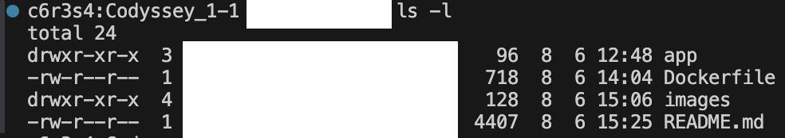
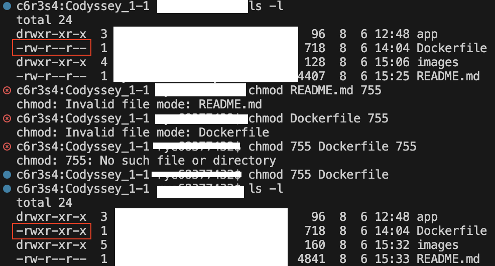

# E1-1_내 컴퓨터에서 개발자용 '작업실' 꾸미기
# 기술 문서만 읽어도 전체 수행 내용을 파악할 수 있어야 한다!
<!------------------------------------ 구분선 ------------------------------------>

## 1. 프로젝트 개요 (미션 목표 요약)
- 개발 워크스테이션은 팀원 누구나 같은 방식으로 실행, 배포, 디버깅할 수 있는 환경 구성을 목표로 한다.
- 이 과정에서 핵심 도구인 리눅스 CLI(터미널), Docker(컨테이너), Git/GitHub(버전 관리 및 협업)를 함께 사용할 수 있다.
    - 터미널로 작업 디렉토리의 권한 설정할 수 있다.
    - Docker를 설치 및 점검하고 컨테이너를 실행/관리할 수 있다.
    - 간단한 웹 서버를 Dockerfile로 컨테이너화하고, 포트 매핑을 접속을 확인하며, 바인드 마운트/볼륨으로 "변경 반영"과 "데이터 영속성"을 직접 검증한다.
    - 실행 결과(로그/접속/데이터 유지)로 핵심 흐름을 확인한다.
    - 이미지와 컨테이너의 분리, 격리된 실행 환경, 포트 및 스토리지 연결 방식의 설계가 왜 필요한지 설명 가능한 형태로 정리한다.
- 같은 서비스를 여러 번 실행해도 재현할 수 있는 원리를 익힌다.
- **해당 경험들을 통해 리눅스 트러블 슈팅, CI/CD 파이프라인, 클라우드 배포/운영 등으로 기술 확장할 수 있다.**

<!------------------------------------ 구분선 ------------------------------------>
## 2. 실행 환경 (OS/쉘/터미널, Docker 버전, Git 버전)

- OS : mac OS
- Shell : bash
- Docker : Docker version 28.5.2
- Git : git version 2.53.0


<!------------------------------------ 구분선 ------------------------------------>
## 3. 수행 항목 체크리스트 (README.MD/터미널/Git/GitHub/권한/Docker/포트/Dockerfile/DockerCompose)

### 1. README.MD
- [v] '`# 가장 큰 제목`'         # 가장 큰 제목
- [v] '`## 중간 제목`'          ## 중간 제목
- [v] '`### 소제목`'           ### 소제목
- [v] '`**굵게**`'            **굵게**  
- [v] '`*기울임*`'            *기울임*  
- [v] '`~~취소선~~`'          ~~취소선~~    
- [v] '`Option + Shift + ↓`' 해당 줄을 아래로 복사

### 2. Terminal
- [v] `pwd`                   현재 작업중인 디렉토리 위치 확인
- [v] `ls -la`                숨김 파일 포함 목록 확인
- [v] `mkdir -p`              작업 디렉토리/폴더 생성
- [v] `cd`                    디렉토리 이동
- [v] `touch`                 빈 파일 생성
- [v] `cp`                    파일 복사
- [v] `mv`                    파일 이름 변경 및 이동
- [v] `rm` / `rmdir`          파일 / 디렉토리 삭제
- [v] `cat` / `head` / `tail` 파일 전체 / 상위 10줄 / 하위 10줄 표시

### 3. Git
- [v] `git config --global user.name` 및 `user.email` 사용자 정보 설정
- [v] `git init` 저장소 초기화(최초 설정)
- [v] `git status` / `git log` 상태 확인
- [v] `git add` 및 `git commit`을 통한 버전 내역 기록
- [v] **git 영역 구분**<br/>

| 단계 | 영역 | 명령어 | 설명 |
| :---: | :--- | :--- | :--- |
| 1️⃣ | 작업 디렉토리 (Working Directory) | - | 파일 수정 |
| 2️⃣ | 스테이징 영역 (Staging Area) | `git add .` | 변경사항 준비 |
| 3️⃣ | 로컬 리포지토리 (Local Repository) | `git commit -m "메시지"` | 스냅샷 저장 |
| 4️⃣ | 원격 리포지토리 (Remote Repository) | `git push` | GitHub 업로드 |

### 4. GitHub
- [v] GitHub 로그인 및 과제용 원격 저장소(Repository) 생성
- [v] `git remote add origin <저장소 URL>` 원격 저장소 연동
- [v] `git push -u origin main` 성공 확인
- [v] VSCode와 GitHub 계정 연동 상태 확인 (스크린샷 첨부)

- [v] 비밀번호, 토큰 등 민감한 개인정보 마스킹 처리 여부 점검

### 5. 권한 (Permission)
- [v] `ls -l` 명령어로 파일 및 디렉토리의 현재 권한(r/w/x) 확인

- [v] `chmod` 권한 변경 실습

- [v] 권한 표기법(755, 644 등)의 숫자별 의미 정리
    - r (read)    = 4
    - w (write)   = 2
    - x (execute) = 1
    - (ex) 755 = 소유자 모든 권한 / 그룹 및 기타 사용자 쓰기 제한. 읽기, 실행 가능

### 6. Docker
- [v] `docker --version`으로 설치 버전 확인
- [v] `docker info` 명령어로 Docker 데몬(또는 OrbStack) 동작 상태 점검
- [v] `docker pull` 및 `docker images`로 이미지 다운로드 및 목록 확인
- [v] `docker ps` 및 `docker ps -a`로 실행 중/종료된 컨테이너 목록 확인
- [v] `docker run -d -p 80:80 --name nginx_latest --restart unless-stopped nginx` 실행 성공 로그 확인
- [v] `docker run -d --name myubuntu ubuntu sleep infinity` 실행, 대화형 컨테이너 진입 및 명령어 실습
- [v] `docker exec -it myubuntu bash` 추가로 우분투에 접속 및 나가더라도 컨테이너는 종료되지 않음.
- [v] `docker logs` 및 `docker stats`로 로그 및 리소스 사용량 점검
- [v] Docker 볼륨 생성 및 컨테이너 삭제 전/후 데이터 영속성 검증
    - `docker volume create myvol` 도커 볼륨 생성
    - `docker volume ls` 도커 볼륨 리스트 확인
    - `docker run -it --name vol-test -v myvol:/data ubuntu bash` 볼륨을 마운트한 컨테이너 실행
    - `docker run --rm -v myvol:/data ubuntu ls -l /data` 볼륨안의 저장된 데이터 확인

### 7. Port
- [v] `docker run -d -p 80:80 --name nginx_latest --restart unless-stopped nginx` 실행 성공 로그 확인

### 8. Dockerfile
- [v] 웹 서버 생성을 위한 베이스 이미지 선정 (예: NGINX / Alpine)
- [v] 커스텀 포인트(환경변수 `ENV`, 콘텐츠 복사 `COPY` 등) 적용하여 Dockerfile 작성
- [v] `docker build -t <이미지명>:<태그> .` 커스텀 이미지 빌드 성공
- [v] 빌드된 커스텀 이미지를 기반으로 컨테이너 정상 구동 확인

### 9. Docker-Compose
- [v] Dockerfile 이란?
    - Dockerfile은 Docker 이미지를 만들기 위한 설계서입니다. 어떤 베이스 이미지를 쓸지, 어떤 파일을 복사할지, 어떤 명령을 실행할지 적습니다.
- [v] Dockerfile 기본 흐름
    - FROM ubuntu:latest (*첫 줄 주의!* 주석은 FROM 지시어보다 먼저올 수 없음! 항상 FROM 먼저.)
    - WORKDIR /app
    - COPY . .
    - RUN apt update
    - CMD ["bash"] (해당 컨테이너를 실행할 때 먼저 실행할 앱)

### 10. Folder Tree 
```
Codyssey_1-1/
├── app/
│   └── index.html          # 커스텀 웹페이지 (HTML)
├── docs/
│   └── images/             # 각종 실행 캡처 이미지
├── Dockerfile              # NGINX 베이스 커스텀 이미지 빌드 파일
├── Docker-compose.yml
├── .gitignore              # 민감정보 및 불필요 파일 제외
└── README.md               # 최종 제출용 기술 문서
```

<!------------------------------------ 구분선 ------------------------------------>
## 4. 수행 로그 확인

### 1. `pwd`
```
c6r3s4:Codyssey_1-1 rye68377432$ pwd
/Users/rye68377432/Documents/Codyssey_1-1
```

### 2. `ls -la`
```
```

### 3. 
```
```

### 4. 
```
```

### 5. 
```
```

### 6. 
```
```

### 7. 
```
```

### 8. 
```
```

### 9. 
```
```

### 10. 
```
```

### 11. 
```
```

<!------------------------------------ 구분선 ------------------------------------>
## 5. 트러블슈팅 2건 이상 (문제 → 원인 가설 → 확인 → 해결/대안)