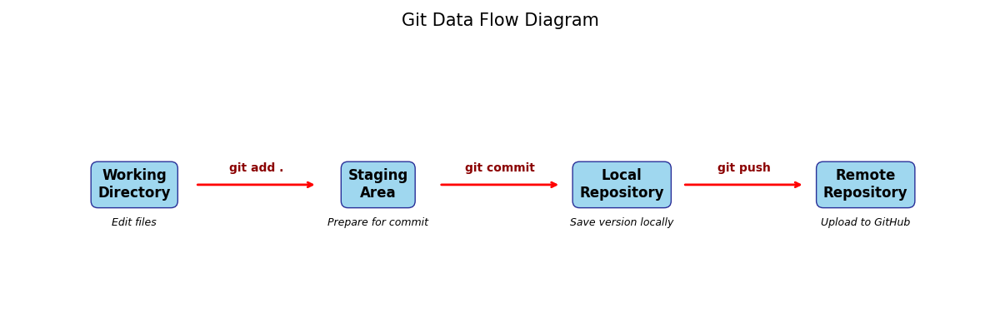
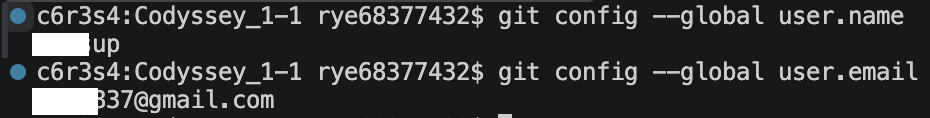

# E1-1_내 컴퓨터에서 개발자용 '작업실' 꾸미기

## 1. 프로젝트 개요 (미션 목표 요약)
- 개발 워크스테이션은 팀원 누구나 같은 방식으로 실행, 배포, 디버깅할 수 있는 환경 구성을 목표로 한다.
- 이 과정에서 핵심 도구인 리눅스 CLI(터미널), Docker(컨테이너), Git/GitHub(버전 관리 및 협업)를 함께 사용할 수 있다.
    - 터미널로 작업 디렉토리의 권한 설정할 수 있다.
    - Docker를 설치 및 점검하고 컨테이너를 실행/관리할 수 있다.
    - 간단한 웹 서버를 Dockerfile로 컨테이너화하고, 포트 매핑을 접속을 확인하며, 바인드 마운트/볼륨으로 "변경 반영"과 "데이터 영속성"을 직접 검증한다.
    - 실행 결과(로그/접속/데이터 유지)로 핵심 흐름을 확인한다.
    - 이미지와 컨테이너의 분리, 격리된 실행 환경, 포트 및 스토리지 연결 방식의 설계가 왜 필요한지 설명 가능한 형태로 정리한다.
- 같은 서비스를 여러 번 실행해도 재현할 수 있는 원리를 익힌다.
- **해당 경험들을 통해 리눅스 트러블 슈팅, CI/CD 파이프라인, 클라우드 배포/운영 등으로 기술 확장할 수 있다.**

## 2. 실행 환경 (OS/쉘/터미널, Docker 버전, Git 버전)

- 선택: (B) Linux 베이스 이미지 + 기능 추가
- 베이스: ubuntu:24.04
- 설치 패키지: python3, curl
- 사용자: codyssey
- 환경 변수: APP_PORT, APP_MESSAGE
- Docker HEALTHCHECK 추가

## 3. 수행 항목 체크리스트 (터미널/권한/Docker/Dockerfile/포트/Git/GitHub)

### 0. README.MD
- [v] '`# 가장 큰 제목`'         # 가장 큰 제목
- [v] '`## 중간 제목`'          ## 중간 제목
- [v] '`### 소제목`'           ### 소제목
- [v] '`**굵게**`'            **굵게**  
- [v] '`*기울임*`'            *기울임*  
- [v] '`~~취소선~~`'          ~~취소선~~    
- [v] '`Option + Shift + ↓`' 해당 줄을 아래로 복사

### 1. Terminal
- [v] `pwd`                   현재 작업중인 디렉토리 위치 확인
- [v] `ls -la`                숨김 파일 포함 목록 확인
- [v] `mkdir -p`              작업 디렉토리/폴더 생성
- [v] `cd`                    디렉토리 이동
- [v] `touch`                 빈 파일 생성
- [v] `cp`                    파일 복사
- [v] `mv`                    파일 이름 변경 및 이동
- [v] `rm` / `rmdir`          파일 / 디렉토리 삭제
- [v] `cat` / `head` / `tail` 파일 전체 / 상위 10줄 / 하위 10줄 표시

### 2. Git
- [v] `git config --global user.name` 및 `user.email` 사용자 정보 설정
- [v] `git init` 저장소 초기화(최초 설정)
- [v] `git status` / `git log` 상태 확인
- [v] `git add` 및 `git commit`을 통한 버전 내역 기록
- [v] **git 영역 구분** 
| 단계 | 영역 | 명령어 | 설명 |
|------|------|--------|------|
| 1️⃣ | 작업 디렉토리 | - | 파일 수정 |
| 2️⃣ | 스테이징 영역 | `git add .` | 변경사항 준비 |
| 3️⃣ | 로컬 리포지토리 | `git commit -m` | 스냅샷 저장 |
| 4️⃣ | 원격 리포지토리 | `git push` | GitHub 업로드 |
- 

### 3. GitHub
- [v] GitHub 로그인 및 과제용 원격 저장소(Repository) 생성
- [v] `git remote add origin <저장소 URL>` 원격 저장소 연동
- [v] `git push -u origin main` 성공 확인
- [v] VSCode와 GitHub 계정 연동 상태 확인 (스크린샷 첨부)

- [v] 비밀번호, 토큰 등 민감한 개인정보 마스킹 처리 여부 점검

### 4. 권한 (Permission)
- [v] `ls -l` 명령어로 파일 및 디렉토리의 현재 권한(r/w/x) 확인
- [v] `chmod` 권한 변경 실습

- [v] 
- [v] 

### 5. Docker

### 6. DOckerfile

### 7. Port
    - docker build -t codyssey-custom:latest .
    -  docker run --rm -p 8080:8080 codyssey-custom:latest
    -  curl http://localhost:8080

## 4. 검증 방법 (어떤 명령으로 무엇을 확인했는지) + 결과 위치 링크

- docker build 성공
- curl 응답 200 OK
- HEALTHCHECK 정상

## 5. 트러블슈팅 2건 이상 (문제 → 원인 가설 → 확인 → 해결/대안)

## 6. 기술 문서만 읽어도 전체 수행 내용을 파악할 수 있어야 한다.